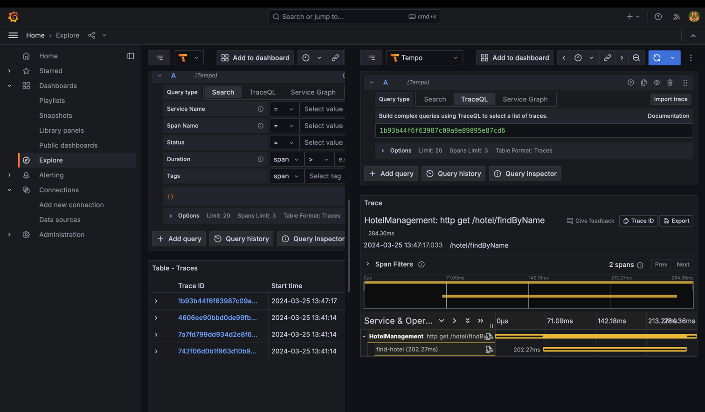

# HotelManagement

#### Start application:
  - Prepare environment: Java 17 + gradle 8.4
  - Build project: gradle build
  - Start application: docker-compose up -d --build

#### Documentation:

- Swagger url: http://localhost:8080/swagger-ui/index.html#
- Tracing + Monitoring: using grafana + prometheus + otel-collector + loki + tempo + zipkin + jaeger
    
  -  Grafana url: http://localhost:3000/login (admin/admin)
  
  - Zipkin url: http://localhost:9411/zipkin
  